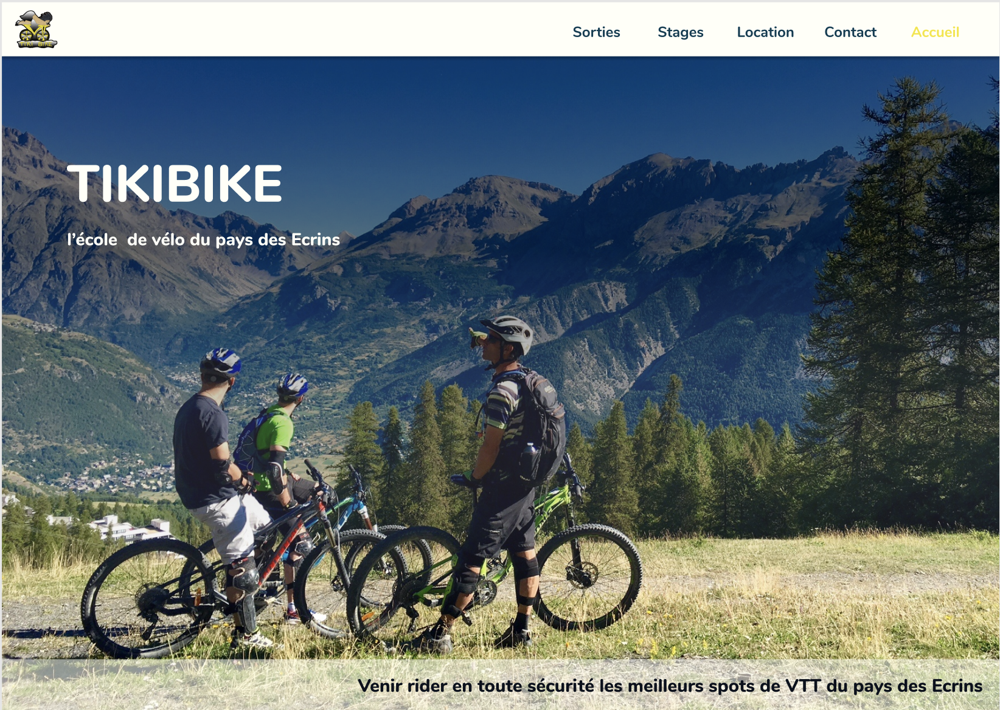
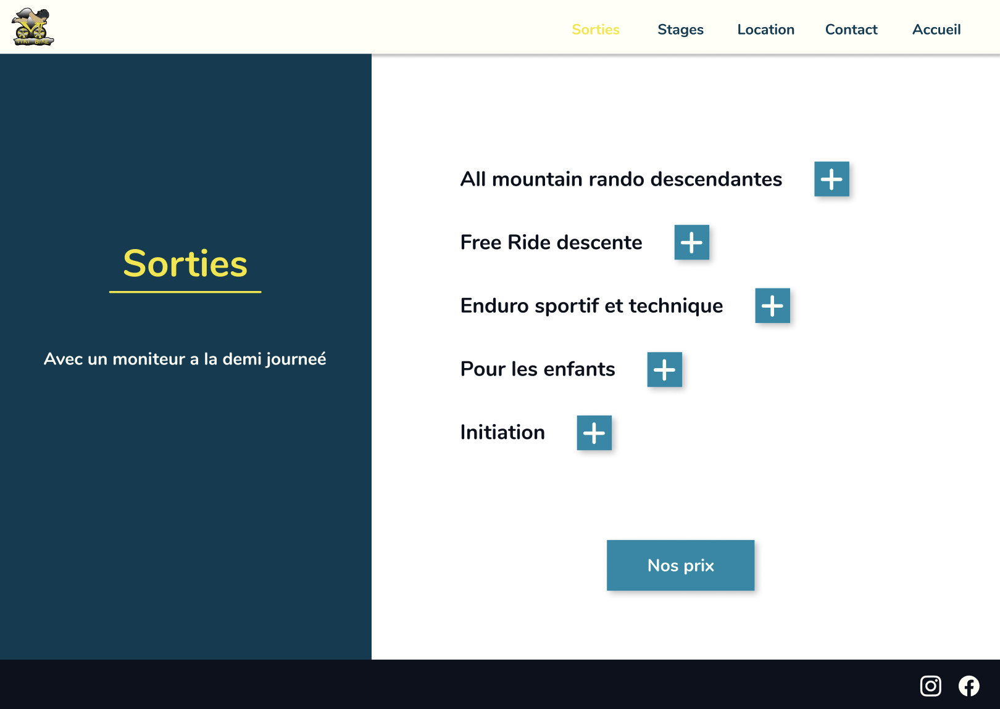
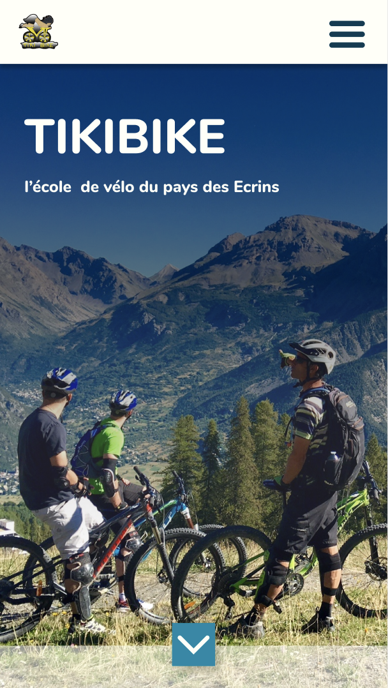
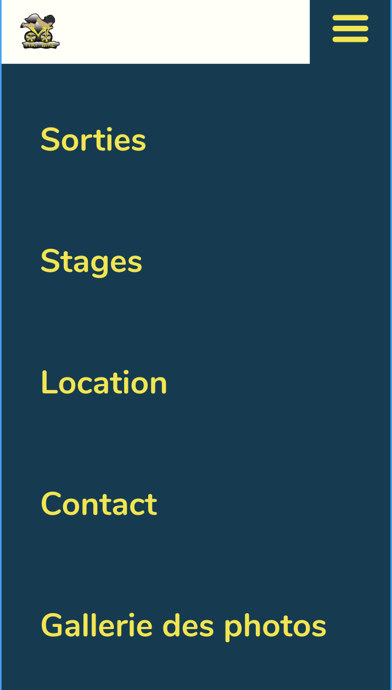

# Tikibike

### Description

This is the website I made for a local bike rental business located in the french north-apline region. It's the first functional website I made from scratch for a real client. The design was made by **@MAlexGG**

### Design

The design of the web, made with Figma, was entirely made by **@MAlexGG**. Main colors were chosen from the business brand. 

### Technologies

* HTML
* CSS
* Javascript
* React
* Figma

_As a banal attempt of disclaimer for any huge mistake, it is worht to say that is the first time I try React to builf anything. A great experience, tho !_

### Collaborators

**@MAlexGG** was in charge of the design. Props to her !
